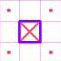
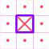

# SeaBattleWeb
Морской бой (игра)
### Запуск
В терминале ввести
```
docker-compose up
```
В браузере перейти по адресу [localhost](http://localhost)
### Особенности игры
* Корабли выставляются автоматически в случайном порядке как вражеские, так и свои.
* После попадания в корабль выставляются метки "мимо" по диагонали от координат попадания.

  
* Вокруг потопленного корабля выставляются метки "мимо".

  